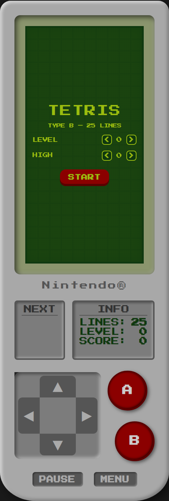
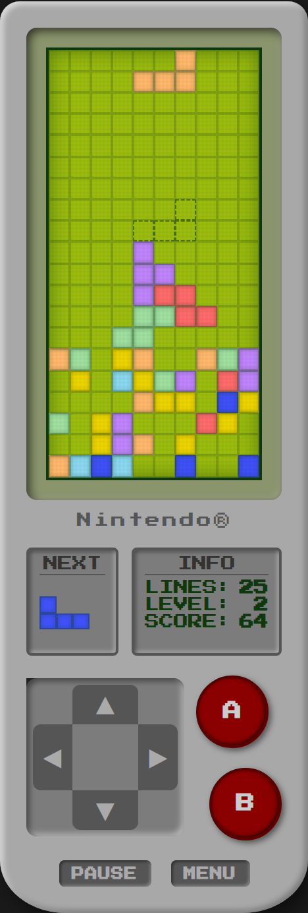
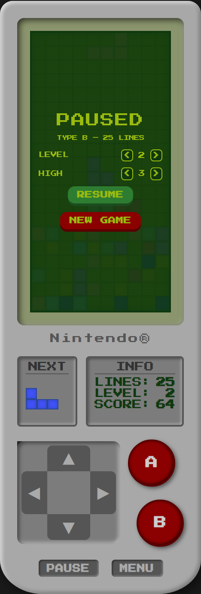

# Tetris Type B — Game Boy

Un clon de Tetris con estética de Game Boy, centrado en el modo **Type B**, empaquetado como **PWA**: se instala como app y funciona **sin conexión**. Todo en un único archivo HTML, sin dependencias ni servidores.


---

## Capturas

<p align="center">
  
  &nbsp;&nbsp;
  
  &nbsp;&nbsp;
  
</p>

---

## Características

- **Modo Type B fiel al original**: eliges nivel inicial (fijo toda la partida) y una altura de basura de partida; ganas al limpiar 25 líneas, que se cuentan en descenso.
- **Reparto 7-bag**: cada set de 7 piezas contiene los 7 tetrominós barajados, para evitar rachas injustas.
- **Ghost piece**: sombra que muestra dónde caerá la pieza.
- **DAS (auto-repetición)**: mantén pulsado izquierda/derecha/abajo para moverte de forma continua.
- **Rotación clásica** estilo Game Boy (horario y antihorario) con *wall kick* básico para no trabarse contra las paredes.
- **Puntuación clásica** 40 / 100 / 300 / 1200 × (nivel + 1), más puntos por soft-drop y hard-drop.
- **Menú no destructivo**: entra al menú y vuelve a la partida en curso con RESUME, o empieza una nueva con NEW GAME.
- **Controles táctiles + teclado**, y estética LCD Game Boy con la fuente incrustada (funciona offline).
- **Instalable** en Android e iOS y jugable sin conexión.

---

## Cómo se juega

### Controles táctiles

| Botón | Acción |
|------|--------|
| ◄ ► | Mover (mantén pulsado = repetición) |
| ▼ | Bajar (soft drop, suma puntos) |
| ▲ | Soltar de golpe (hard drop) |
| A | Rotar en sentido horario |
| B | Rotar en sentido antihorario |
| PAUSE | Pausar / reanudar |
| MENU | Abrir el menú (RESUME / NEW GAME) |

### Teclado (escritorio)

| Tecla | Acción |
|------|--------|
| ← → | Mover |
| ↓ | Soft drop |
| ↑ o X | Rotar horario |
| Z | Rotar antihorario |
| Espacio | Hard drop |
| P | Pausa |
| Enter | Empezar / partida nueva |
| Esc | Volver a la partida desde el menú |

---

## El modo Type B

En Type B eliges dos cosas antes de empezar:

- **LEVEL (0-9)**: fija la velocidad de caída durante toda la partida (no cambia al limpiar líneas).
- **HIGH (0-5)**: altura de la basura inicial; cada unidad son 2 filas de bloques aleatorios (de 0 a 10 filas).

El contador **LINES** empieza en 25 y baja según limpias líneas. Al llegar a 0 (25 líneas limpiadas) ganas la partida.

---

## Ejecutar en local

Un PWA **no funciona abriendo el archivo directamente** (`file://`): el service worker necesita servirse por HTTP. Desde la carpeta del proyecto:

```bash
python -m http.server 8000
```

Luego abre `http://localhost:8000` en el navegador. (También sirve cualquier servidor estático, p. ej. `npx serve`.)

---

## Publicar (deploy)

Cualquiera de estos hosting gratuitos con HTTPS sirve; solo hay que subir **todos los archivos juntos** conservando los nombres y las rutas relativas.

- **GitHub Pages**: sube el repo, entra en `Settings → Pages`, elige la rama y la carpeta raíz. Tu app quedará en `https://<usuario>.github.io/<repo>/`.
- **Netlify** o **Vercel**: arrastra la carpeta o conecta el repo; el HTTPS es automático.

> El HTTPS es obligatorio para que el navegador registre el service worker y ofrezca instalar la app.

---

## Instalar en el móvil

Una vez publicado y abierto desde la URL:

- **Android / Chrome**: menú (⋮) → *Instalar app* / *Añadir a pantalla de inicio*.
- **iPhone / Safari**: botón Compartir → *Añadir a pantalla de inicio*.

Ya instalada, se abre a pantalla completa y funciona sin conexión.

---

## Actualizar el juego

El service worker cachea la versión actual. Si editas `index.html`, sube la versión del caché en `sw.js`:

```js
const CACHE = 'tetris-typeb-v1';   // cámbialo a v2, v3, ...
```

Así los dispositivos toman la versión nueva la próxima vez que abran la app con conexión.

---

## Detalles técnicos

- **Un solo archivo de juego** (`index.html`): HTML, CSS y JavaScript juntos, sin frameworks ni librerías.
- **Fuente incrustada** (Press Start 2P en base64), por lo que la estética se mantiene incluso sin internet.
- **Render eficiente**: las 200 celdas del tablero se crean una sola vez y solo cambian de clase.
- **Bucle con `requestAnimationFrame`**, independiente de los FPS del dispositivo.
- **Layout responsive**: el menú escala al ancho del tablero con *container queries*, así que no se recorta en pantallas pequeñas.

### Estructura de archivos

```
.
├── index.html                 El juego (HTML + CSS + JS + fuente incrustada)
├── manifest.webmanifest       Datos de la app (nombre, iconos, colores)
├── sw.js                      Service worker (caché offline)
├── icon-192.png               Icono 192×192
├── icon-512.png               Icono 512×512
├── icon-maskable-512.png      Icono maskable (zona segura)
├── apple-touch-icon.png       Icono para iOS
├── favicon.png                Favicon
└── screenshots/               Imágenes del README
```

---

## Licencia y aviso

Proyecto personal/educativo. El código puede publicarse bajo licencia **MIT** (añade un archivo `LICENSE` si quieres formalizarlo).

Tetris® es una marca registrada de The Tetris Company. Este proyecto es un homenaje independiente hecho con fines de aprendizaje y **no está afiliado ni respaldado** por The Tetris Company ni por Nintendo.
